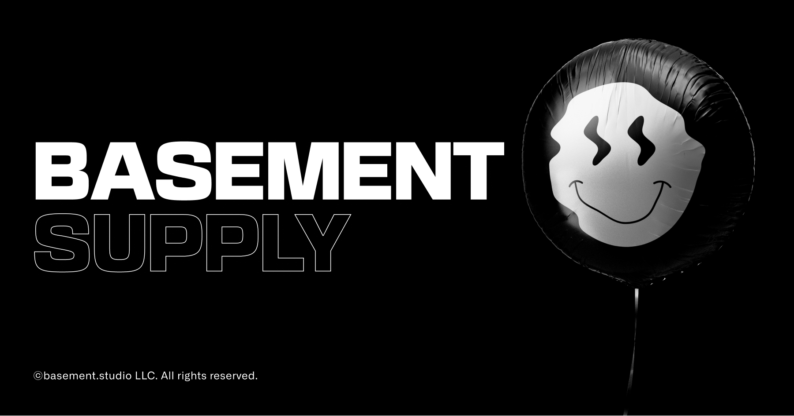

# basement-challenge



### :us: 

We have to implement a Figma design (the design team worked very hard on the figma file, but for this first stage we can skip some details as long as everything works). Since the backend is not ready yet, there is a mock file in /product/mock.json.

The checkout is not ready, so printing the purchase details to console is enough.

You are free to do it in whatever stack you prefer, knowing that we mainly use Next.js with TypeScript (feel free to check out our [Tech Stack](https://basementstudio.notion.site/37ff8d1b790a4916b0fe6576ad643a72)).

They also said that it's not required but would give us an extra bonus for each of these points:
- Integration tests with Cypress
- Unit testing with Jest and React Testing Library
- Persisting the cart to localStorage

It's asserted that the products will always be there and won't ever change, so we can save them in whichever way we please.
The code should be as clean as possible so that when the backend is ready the changes would be minimum to get everything working.

Also, since the client doesn't know much about programming they asked us to deploy our application somewhere and send them a link to check the progress.

### :es: 
Tenemos que implementar el diseño de este figma (el equipo de diseño trabajó mucho en el figma, para esta primera etapa podemos omitir detalles mientras todo ande), como el backend todavía no está desarrollado el cliente nos dejó un mock en /product/mock.json.

El checkout no está listo tampoco así que con imprimir en consola el pedido al clickear en CHECKOUT alcanza.

El cliente generalmente utiliza Next.js con TypeScript, pero nos dejó libertad para usar el stack que prefieramos.

También nos dijo que no era requerido, pero nos iba a pagar un importante bono por cada punto extra:

- Tests de integración con Cypress
- Tests unitarios con Jest y React Testing Library
- Guardar el cart del usuario en localStorage
Nos aseguró que los productos siempre van a estar y nunca se van a modificar, así que podemos guardalos como queramos.
También nos dijo que nos iba a pagar bonos por cualquier idea original que se nos ocurra agregar.

Nos pidió que el código sea lo más prolijo posible, para que cuando el backend este implementado los cambios sean mínimos para poder integrarlo.

Como el cliente no sabe de desarrollo nos pidió que despleguemos nuestra aplicación en algún lado y le mandemos un link para ver el progreso.


## Stack

- Framework: [Next.js](https://nextjs.org)
- Styling: [Stitches](https://stitches.dev)
- Primitives: [Radix](https://radix-ui.com)
- Deployment: [Vercel](https://vercel.com)

## Running locally

```bash
$ git clone https://github.com/andresmarpz/basement-challenge.git
$ cd basement-challenge
$ npm i
$ npm run dev
```

Open [http://localhost:3000](http://localhost:3000) with your browser to see the result.

